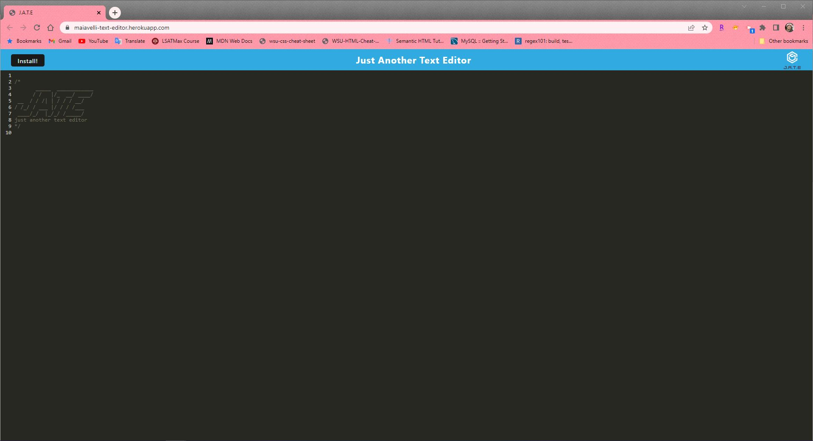

# Just Another Text Editor
[](https://opensource.org/licenses/MIT)

## Description

A text editor that runs in the browser and is also functional offline.

## Table of Contents 
- [Description](#description)
- [Installation](#installation)
- [Link](#link-to-deployed-application)
- [Screenshot](#screenshot)
- [Questions](#questions)
- [License](#license)

## Installation 

To install this application and it's required dependencies, please run: 
```
npm install package.json
```
Once installed, run `npm install` to install the client package.json file. 
Next, run `npm run build` and `npm run start:dev` in that order. The application should launch once finished. 

## Link to Deployed Application
https://maiavelli-text-editor.herokuapp.com/

## Screenshot 



## Questions 

For more information and to see more of my work, please visit my [GitHub](https://github.com/maiavelli/).

For any additional questions or general inquiries, you can contact me at [maiacamilledavis@gmail.com](mailto:maiacamilledavis@gmail.com).

## License

Copyright `2022` `Maia Davis`

Permission is hereby granted, free of charge, to any person obtaining a copy of this software and associated documentation files (the "Software"), to deal in the Software without restriction, including without limitation the rights to use, copy, modify, merge, publish, distribute, sublicense, and/or sell copies of the Software, and to permit persons to whom the Software is furnished to do so, subject to the following conditions:

The above copyright notice and this permission notice shall be included in all copies or substantial portions of the Software.

THE SOFTWARE IS PROVIDED "AS IS", WITHOUT WARRANTY OF ANY KIND, EXPRESS OR IMPLIED, INCLUDING BUT NOT LIMITED TO THE WARRANTIES OF MERCHANTABILITY, FITNESS FOR A PARTICULAR PURPOSE AND NONINFRINGEMENT. IN NO EVENT SHALL THE AUTHORS OR COPYRIGHT HOLDERS BE LIABLE FOR ANY CLAIM, DAMAGES OR OTHER LIABILITY, WHETHER IN AN ACTION OF CONTRACT, TORT OR OTHERWISE, ARISING FROM, OUT OF OR IN CONNECTION WITH THE SOFTWARE OR THE USE OR OTHER DEALINGS IN THE SOFTWARE.